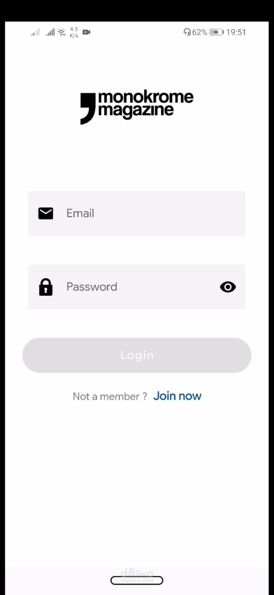
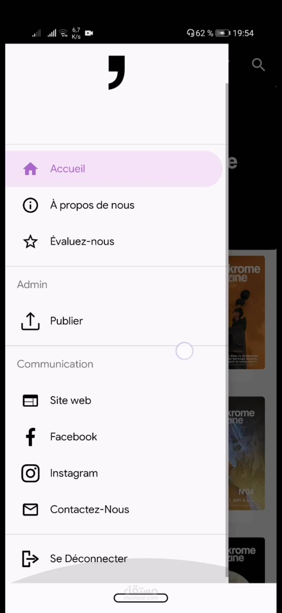
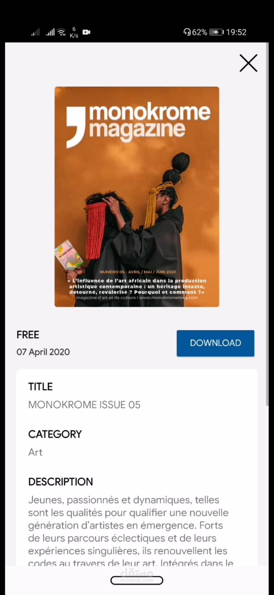

# Monokrome
An App that enables users to download and read content of a local art digital magazine, with an admin spaces that enables  editing and publishing latest issues.

    
    
    
    

## Features
* Authentication (Sign-in/Sign-up)
* Fetching data from network
* Offline support
* Download/ Upload

## App Architecture
The architecture used to create this app is __Model–View–Viewmodel__, it seperated the app into Data layer/Domain/Ui Layer resulting in a readable, robust code. It also leverages the power  of some android jetpack libraries (Navigation, Coroutines, Workmanager, Hilt, Lifecycle, Room). 
